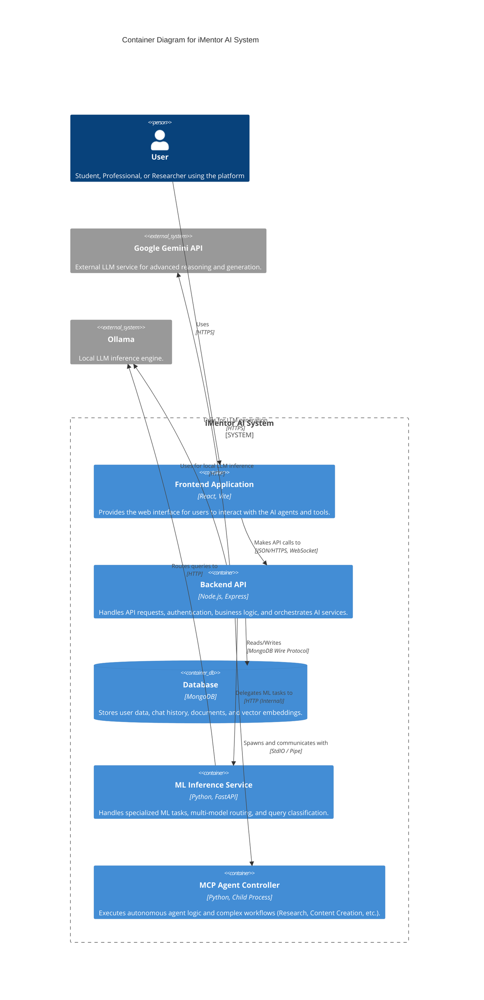

# iMentor AI Architecture

This document describes the high-level architecture of the iMentor AI system.

## Overview

iMentor AI is a full-stack educational platform that leverages a microservices-like architecture (within a monorepo) to provide intelligent tutoring, research assistance, and content generation. It combines a React frontend, a Node.js backend, and specialized Python services for advanced AI capabilities.

## Architecture Diagram (C4 Container Model)

## Component Details

### 1. Frontend Application
- **Tech Stack**: React, Vite, Tailwind CSS, Axios.
- **Role**: Serves as the user interface. It handles user input, displays chat interfaces, renders rich content (Markdown, Charts), and manages state.
- **Communication**: Communicates with the Backend via RESTful APIs and WebSockets (for real-time agent feedback).

### 2. Backend API
- **Tech Stack**: Node.js, Express.js, Mongoose.
- **Role**: The central orchestrator.
  - Manages authentication (JWT).
  - Handles file uploads and processing.
  - Routes requests to appropriate AI services.
  - Manages the WebSocket connection for real-time agent interaction.
- **Key Modules**:
  - `server.js`: Entry point.
  - `mcp_system/`: Handles the "Model Context Protocol" agents via WebSockets and child processes.
  - `routes/`: API route definitions.

### 3. Database
- **Tech Stack**: MongoDB.
- **Role**: Persistent storage for:
  - User profiles and settings.
  - Chat sessions and history.
  - Uploaded file metadata.
  - Vector embeddings (for RAG).

### 4. ML Inference Service
- **Tech Stack**: Python, FastAPI.
- **Role**: Provides specialized machine learning capabilities that are better handled in Python.
  - **Query Classification**: Determines the intent of user queries.
  - **Model Routing**: Decides which LLM (Gemini vs. Ollama models) to use based on complexity and cost.
  - **Embeddings**: Generates vector embeddings for documents.

### 5. MCP Agent Controller
- **Tech Stack**: Python.
- **Role**: Implements the logic for the "Agentic" system.
  - Runs as a child process spawned by the Node.js backend.
  - Executes multi-step workflows (e.g., "Research this topic, then write a report").
  - Coordinates specialized agents (Research Analyst, Content Creator, etc.).

### 6. External & Local AI Services
- **Google Gemini API**: Used for high-intelligence tasks, complex reasoning, and multimodal understanding.
- **Ollama**: Hosted locally (or in a separate container) to run open-source models (Llama 3, Mistral, etc.) for privacy, cost-saving, or offline capabilities.
