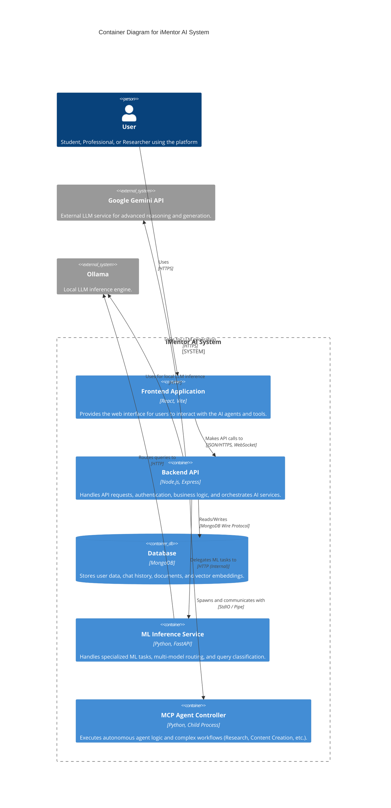

# iMentor AI Architecture

This document describes the high-level architecture of the iMentor AI system.

## Overview

iMentor AI is a full-stack educational platform that leverages a microservices-like architecture (within a monorepo) to provide intelligent tutoring, research assistance, and content generation. It combines a React frontend, a Node.js backend, and specialized Python services for advanced AI capabilities.

## System Context (C4 Container)



## Agent Ecosystem (C4 Component)

This diagram details the "AI Dream Team" agents and their placement within the system components.

```mermaid
C4Component
    title Component Diagram - Agent Ecosystem

    Container_Boundary(backend_api, "Backend API (Node.js)") {
        Component(doc_processor, "Document Processor", "Service", "The Information Alchemist: Extracts text, chunks documents, and manages vector embeddings for RAG.")
        Component(mcp_handler, "MCP WebSocket Handler", "Service", "Manages real-time communication between Frontend and Python Agents.")
    }

    Container_Boundary(mcp_controller, "MCP Agent Controller (Python)") {
        Component(orchestrator, "Workflow Coordinator", "AgentOrchestrator", "The Master Orchestrator: Decomposes complex tasks and routes them to specialized agents.")

        Component(research_agent, "Research Analyst", "ResearchAssistantAgent", "The Knowledge Hunter: Performs deep web search, verification, and synthesis.")
        Component(content_agent, "Content Creator", "CreativeAgent", "The Digital Artisan: Generates reports, presentations, and creative content.")
        Component(learning_agent, "Learning Assistant", "AcademicAssistantAgent", "The Personalized Tutor: Provides tutoring, study plans, and academic tracking.")

        Component(project_agent, "Project Manager", "ProjectManagementAgent", "Manages GitHub repos, collaboration, and deadlines.")
        Component(career_agent, "Career Advisor", "CareerDevelopmentAgent", "Assists with job search, applications, and networking.")
        Component(engineering_agent, "Engineering Tools", "EngineeringToolsAgent", "Specialized in CAD, simulation analysis, and lab reports.")
    }

    Rel(mcp_handler, orchestrator, "Sends requests to", "StdIO/Pipe")
    Rel(orchestrator, research_agent, "Delegates to")
    Rel(orchestrator, content_agent, "Delegates to")
    Rel(orchestrator, learning_agent, "Delegates to")
    Rel(orchestrator, project_agent, "Delegates to")
    Rel(orchestrator, career_agent, "Delegates to")
    Rel(orchestrator, engineering_agent, "Delegates to")

    Rel(backend_api, doc_processor, "Uses for file processing")
```

## Component Details

### 1. Frontend Application
- **Tech Stack**: React, Vite, Tailwind CSS, Axios.
- **Role**: Serves as the user interface. It handles user input, displays chat interfaces, renders rich content (Markdown, Charts), and manages state.
- **Communication**: Communicates with the Backend via RESTful APIs and WebSockets (for real-time agent feedback).

### 2. Backend API
- **Tech Stack**: Node.js, Express.js, Mongoose.
- **Role**: The central orchestrator.
  - **Document Processor**: A specialized service ("The Information Alchemist") that handles file uploads, content extraction (PDF, DOCX), and vector embeddings.
  - Manages authentication (JWT).
  - Routes requests to appropriate AI services.
- **Key Modules**:
  - `server.js`: Entry point.
  - `services/documentProcessor.js`: Handles document parsing and chunking.
  - `mcp_system/`: Handles the "Model Context Protocol" agents via WebSockets and child processes.

### 3. MCP Agent Controller
- **Tech Stack**: Python.
- **Role**: Implements the logic for the "Agentic" system. Runs as a child process spawned by the Node.js backend.
- **Agents**:
  - **Workflow Coordinator**: (`AgentOrchestrator`) The "Master Orchestrator" that analyzes queries and routes them to the correct agent or creates a multi-step workflow.
  - **Research Analyst**: (`ResearchAssistantAgent`) "The Knowledge Hunter". Specialized in web search (DuckDuckGo), fact-checking, and citation management.
  - **Content Creator**: (`CreativeAgent`) "The Digital Artisan". Specialized in writing, storytelling, and content generation.
  - **Learning Assistant**: (`AcademicAssistantAgent`) "The Personalized Tutor". Manages study schedules, grades, and assignments.
  - **Project Manager**: (`ProjectManagementAgent`) Handles GitHub integration and project tracking.
  - **Career Advisor**: (`CareerDevelopmentAgent`) Helps with job applications and interviews.
  - **Engineering Tools**: (`EngineeringToolsAgent`) Manages CAD files and technical reports.

### 4. ML Inference Service
- **Tech Stack**: Python, FastAPI.
- **Role**: Provides specialized machine learning capabilities.
  - **Query Classification**: Determines the intent of user queries.
  - **Model Routing**: Decides which LLM to use.
  - **Embeddings**: Generates vector embeddings for documents.

### 5. Database
- **Tech Stack**: MongoDB.
- **Role**: Persistent storage for user data, chat history, and vector embeddings.
