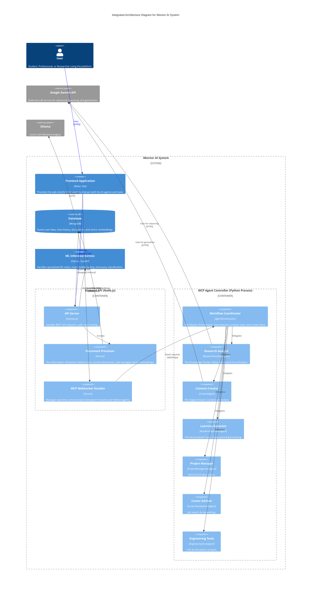

# iMentor AI Architecture

This document describes the high-level architecture of the iMentor AI system.

## Overview

iMentor AI is a full-stack educational platform that leverages a microservices-like architecture (within a monorepo) to provide intelligent tutoring, research assistance, and content generation. It combines a React frontend, a Node.js backend, and specialized Python services for advanced AI capabilities.

## Integrated Architecture Diagram (C4 Component)

This diagram visualizes the complete system, showing how the high-level containers (Frontend, Database, etc.) interact with the internal components of the Agent Ecosystem.

## Component Details

### 1. Frontend Application
- **Tech Stack**: React, Vite, Tailwind CSS, Axios.
- **Role**: Serves as the user interface. It handles user input, displays chat interfaces, renders rich content (Markdown, Charts), and manages state.
- **Communication**: Communicates with the Backend via RESTful APIs and WebSockets (for real-time agent feedback).

### 2. Backend API
- **Tech Stack**: Node.js, Express.js, Mongoose.
- **Role**: The central orchestrator.
  - **API Server**: Handles standard REST endpoints, authentication, and file uploads.
  - **Document Processor**: A specialized service ("The Information Alchemist") that handles file uploads, content extraction (PDF, DOCX), and vector embeddings.
  - **MCP WebSocket Handler**: Manages the bi-directional communication channel for the AI agents.

### 3. MCP Agent Controller
- **Tech Stack**: Python.
- **Role**: Implements the logic for the "Agentic" system. Runs as a child process spawned by the Node.js backend.
- **Agents**:
  - **Workflow Coordinator**: (`AgentOrchestrator`) The "Master Orchestrator" that analyzes queries and routes them to the correct agent or creates a multi-step workflow.
  - **Research Analyst**: (`ResearchAssistantAgent`) "The Knowledge Hunter". Specialized in web search (DuckDuckGo), fact-checking, and citation management.
  - **Content Creator**: (`CreativeAgent`) "The Digital Artisan". Specialized in writing, storytelling, and content generation.
  - **Learning Assistant**: (`AcademicAssistantAgent`) "The Personalized Tutor". Manages study schedules, grades, and assignments.
  - **Project Manager**: (`ProjectManagementAgent`) Handles GitHub integration and project tracking.
  - **Career Advisor**: (`CareerDevelopmentAgent`) Helps with job applications and interviews.
  - **Engineering Tools**: (`EngineeringToolsAgent`) Manages CAD files and technical reports.

### 4. ML Inference Service
- **Tech Stack**: Python, FastAPI.
- **Role**: Provides specialized machine learning capabilities.
  - **Query Classification**: Determines the intent of user queries.
  - **Model Routing**: Decides which LLM to use.
  - **Embeddings**: Generates vector embeddings for documents.

### 5. Database
- **Tech Stack**: MongoDB.
- **Role**: Persistent storage for user data, chat history, and vector embeddings.
